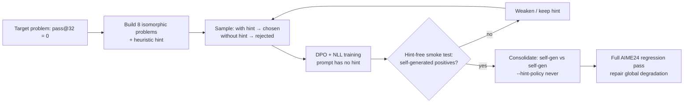

# DPO Ignition: Using DPO Instead of SFT to "Ignite" a Reasoning Model

[中文](README_CN.md) | **English** | 🤗 LoRA weights: [`YichengWangCA/R1-Distill-Qwen-14B-AIME-DPO-LoRA`](https://huggingface.co/YichengWangCA/R1-Distill-Qwen-14B-AIME-DPO-LoRA) 

> DPO ignition with a **rank-32 LoRA** on **DeepSeek-R1-Distill-Qwen-14B**. Out of the 30 AIME 2024 problems, the base model fails 6 in all 32 samples. Ignition cracks 2 of them, raising AIME 2024 **cons@32 from 80.0% (24/30) to 86.7% (26/30)**. The LoRA weights are on [Hugging Face](https://huggingface.co/YichengWangCA/R1-Distill-Qwen-14B-AIME-DPO-LoRA).

---

## Contents

- [Motivation](#motivation)
- [Method: DPO ignition](#method-dpo-ignition)
- [Objective](#objective)
- [Hyperparameters](#hyperparameters)
- [Dataset: AIME 2024](#dataset-aime-2024)
- [Per-problem log](#per-problem-log)
- [Limitations](#limitations)
- [Discussion and future work](#discussion-and-future-work)
- [Repository layout](#repository-layout)
- [Reproduction](#reproduction)
- [Adding a scenario](#adding-a-scenario)

---

## Motivation

On-policy RL such as GRPO can only **amplify a correct signal the model already has**. If the model never succeeds on a problem across many samples, every sample in the group gets the same reward. The advantage is zero, so GRPO has no gradient to work with.

The usual fix is a round of SFT that injects external information so the model starts producing a correct signal from nothing. This stage is called **ignition**. Conventional SFT has two problems:

1. **Distribution damage.** SFT positives usually come from a different model (or human-written solutions). Transplanting that distribution onto the target model can do real harm to its original distribution.
2. **Data cost.** SFT needs many positives, typically around 100 distinct solution paths.

## Method: DPO ignition

The core idea: **the positives are generated by the target model itself, with the help of a heuristic hint at generation time. The hint is removed at training time.**

1. **Write a heuristic hint.** Add a scenario-specific hint to the prompt so that the model *spontaneously* produces a correct chain of thought (CoT).
2. **Build preference pairs.**
   - Chosen: a correct CoT the model generates **with** the hint.
   - Rejected: the model's original wrong output **without** the hint.
   - The training prompt is always the **hint-free** problem statement.
3. **Iterate with hint smoke tests.** After each DPO round, smoke-test with a progressively weaker hint and check whether the model still produces a correct signal. Keep going until the model solves the problem with **no hint at all** (a "self-generated positive"). At that point the hint has been internalised into the model's own distribution.
4. **Consolidate.** Once self-generated positives appear, switch to "self-generated positive vs. self-generated negative" pairs for a few more rounds to stabilise the new ability.



Compared with SFT, this has two advantages:

- **Positives come from the model's own distribution.** A hinted CoT is still sampled from the target model, so it sits much closer to the model's original distribution than a solution written by an external model.
- **Negatives say which path not to take.** DPO raises the correct path and also explicitly pushes down the wrong path the model originally preferred (for II-9, typically "forgetting to add back the 2 monochrome grids").

### Why isomorphic problems instead of the original

Training on the original problem would contaminate evaluation. The original AIME24 problem is always kept as a **held-out probe** and never enters the training set. All ignition data comes from programmatically generated isomorphic problems: different parameters, the same structure. Answers are computed exactly with `Fraction`, and at startup each script re-derives the original problem's official answer to self-check its formula.

### Data quality control (`gen_ignition_pairs.py`)

| Problem | Handling |
|---|---|
| A hinted positive says "The hint says…" | The training prompt has no hint, so this would teach the model to cite a hint that isn't there. Such phrases are first rewritten by regex into first-person reasoning. Samples with leftover mentions, or that quote long spans of the hint verbatim, are dropped |
| A hinted positive just plugs into the formula | The CoT must show the scenario's derivation (e.g. *collinear / similar triangles* for torus) |
| A self-generated positive is a lucky guess | Each scenario can define a quality gate (e.g. chips requires *maximal/empty* and `2^`) |
| Noise / tail repetition / truncation | Counted separately; truncated samples with no `\boxed{}` are kept as valid negatives |
| Negative diversity | A scenario can bucket negatives by failure mode and interleave them (chips: `count-2` / `2^(m+n)-2` / `2^(m+n)`) |

## Objective

A single-stage objective: DPO plus an NLL term on the positive.

$$
\mathcal{L} = -\log\sigma\Big(\beta\big[(\ell_\theta(y_c)-\ell_{\text{ref}}(y_c)) - (\ell_\theta(y_r)-\ell_{\text{ref}}(y_r))\big]\Big) + \lambda\cdot\Big(-\frac{\ell_\theta(y_c)}{W_c}\Big)
$$

where $\ell(y)=\sum_t w_t\log\pi(y_t\mid x,y_{<t})$ is the (weighted) sequence log-probability.

**Design of the two terms:**

- **NLL term.** Standard DPO often pushes the positive's likelihood down along with the negative's, a known failure mode. The NLL term raises how often the positive is produced and keeps its likelihood from collapsing. It is averaged per token (divided by the weighted length $W_c$).
- **The DPO term uses sum, not per-token normalisation.** The number of tokens spent on a solution is itself important information and should not be diluted by length. Using the sum also naturally penalises overly long CoTs.
- **Length damping (LD-DPO style, `--ld-alpha`).** Let $K=\min(|y_c|,|y_r|)$ be the shared length. The first $K$ tokens get weight $w_t=1$ and tokens beyond it get $w_t=\alpha$, with $W=K+\alpha(|y|-K)$. $\alpha=1$ is standard DPO; $\alpha=0$ is equivalent to truncating the longer side to the shared length. The motivation: the rejected answer (usually the longer side) may still contain valid Bayesian reasoning. It may have just made an early mistake or missed the right method, so the whole trace should not be pushed down.

**Implementation details that affect reproduction (`train_dpo_nll.py`):**

- **Reference logprobs are precomputed once** with the starting adapter's weights (i.e. the reference) and cached, so no LoRA swapping is needed during training.
- **Chunked projection over the LM head.** Hidden states are computed once, then only the completion positions are projected through `lm_head` in chunks, so the full `[seq, vocab]` logits tensor is never materialised. At 22k tokens this saves about 6.2 GiB per sequence.
- **EOS is appended to positives only.** Sampling decodes with `skip_special_tokens=True`, which strips the model's own EOS; appending it restores the real target. 
- **Degenerate pairs are dropped at load time**: empty positive, empty negative, or identical pair. Each silently produces a zero or one-sided gradient while the training log still looks healthy.

## Hyperparameters

These hyperparameters and sample sizes are for **DeepSeek-R1-Distill-Qwen-14B + rank-32 LoRA (4-bit NF4 QLoRA)**.

| Parameter | Value | Notes |
|---|---|---|
| LoRA rank / alpha / dropout | 32 / 64 / 0.05 | `init_lora.py` defaults |
| Target modules | `q,k,v,o,gate,up,down_proj` | |
| Trainable parameters | 137,625,600 | |
| Base precision | 4-bit NF4, double quantisation, bf16 compute | |
| Pairs per round | ~200 | 8 isomorphic problems × 32 samples each; 200 pairs per round was the stable setting |
| β (DPO temperature) | 0.1 | Sweep β / λ / LR in the first round and keep the lowest loss |
| λ (NLL weight) | 0.2 | |
| Learning rate | 5e-6, AdamW | |
| Epochs | 2 | Loss has usually settled by the second epoch |
| Gradient accumulation | 4 | |
| DPO log-prob normalisation | `sum` | See [Objective](#objective) |
| `--ld-alpha` | 0.2 – 0.3 | Introduced from the second problem (I-8) on; see below |
| Sampling temperature / top-p | 0.6 / 0.95 | Same for sampling and evaluation |
| Max sequence length | 18500 | Both sampling `--max-new-tokens` and training `--max-len` (script defaults are 16000 / 22000) |

**Why `--ld-alpha`.** I-8 was ignited with α=1. Accuracy on that problem improved a lot, but other AIME24 problems degraded noticeably. One hypothesis is that standard DPO also pushes down reasoning fragments in the negatives that were actually correct. This needs more ablations to confirm.

**Why temperature 0.6.** Higher temperatures severely hurt accuracy on long chains of thought and make training harder.

## Dataset: AIME 2024

I started with `simplescaling/aime24_nofigures`, but **Problem I-8 is missing a condition** there, and `simplescaling/aime24_figures` did not fix it either. So I built my own AIME 2024 dataset: **[`YichengWangCA/aime24-official`](https://huggingface.co/datasets/YichengWangCA/aime24-official)**.

**Baseline.** DeepSeek-R1-Distill-Qwen-14B scores pass@32 = **80% (24/30)** on AIME 2024, with pass@1 around **52%**. The 6 problems it fails in all 32 samples:

| Problem | Ignited? | Outcome |
|---|---|---|
| 2024-I-8 | ✅ | Solved |
| 2024-I-11 | Attempted, abandoned | — |
| 2024-I-12 | — | |
| 2024-II-8 | ✅ | Solved in isolation; too much global degradation, abandoned |
| 2024-II-9 | ✅ | Solved |
| 2024-II-15 | — | |

I-8, II-8 and II-9 were chosen for ignition because isomorphic variants are easy to construct for them.

## Per-problem log

### 2024 AIME II-9: chips in a 5×5 grid (solved, 5 rounds)

Scenario: `chips`. Variants are $m\times n$ grids with answer $2+(2^m-2)(2^n-2)$. The 8 variants are 2×2, 2×3, 3×3, 3×4, 4×4, 3×6, 4×6, 4×7. The original 5×5 is held out.

| Round | Positive source | Pairs | Result |
|---|---|---|---|
| R1 | hint | 50 | Hinted accuracy rises; total tokens in closed-book outputs drop |
| R2 | hint | 50 | Same trend continues |
| R3 | hint | 200 | **Self-generated positives appear** |
| R4 | self-gen | 50 | Consolidation |
| R5 | self-gen | 50 | Consolidation |

> In the self-generated stage one positive can be paired with several negatives, but **pairing the same positive with more than 4 negatives causes degradation** (`--max-reuse 4`).

### 2024 AIME I-8: chain of tangent circles (solved, 3 rounds)

Scenario: `circles`. Variants change the radius and count of the two circle chains $(r_1,n_1,r_2,n_2)$; the script also checks that the triangle exists.

| Round | Positive source | Pairs | Result |
|---|---|---|---|
| R1 | hint | ~200 | **Self-generated positives appear** |
| R2 | self-gen | ~200 | Consolidation |
| R3 | self-gen | ~200 | Consolidation |

### Global regression repair

After igniting these two problems, overall AIME24 **pass@1 dropped sharply** (from about 52% before ignition). I then ran self-generated pairing on the full AIME24 set with `gen_dpo_dataset.py` (32 samples per problem, ~200 pairs). After 2 rounds of training, pass@1 recovered to **64%**, with pass@32 at **26/30**.

> ⚠️ This repair round trains on self-generated pairs from AIME24 itself, so the 64% pass@1 is an **in-training-set** number and should not be read as evidence of generalisation. The ignition result itself (I-8 and II-9 going from zero to solved) used only isomorphic problems, with the originals always held out, so it is unaffected.

### 2024 AIME II-8: torus–sphere tangency (solved in isolation, abandoned due to global degradation)

Scenario: `torus`. Variants change (tube radius, axis distance, sphere radius). Two hint strengths are provided: `strong` and `weak`.

- After 3 rounds of 200-pair DPO, self-generated positives appeared, but overall AIME24 pass@32 dropped too much.
- I rolled back to the checkpoint after the first 200-pair round and trained on the AIME24 self-generated pairs merged with this problem's 8 variants × 32 samples. That didn't work well either.
- Hypothesis: training may have hit the trainable capacity a rank-32 LoRA can provide (see [Limitations](#limitations)).

### 2024 AIME I-11: two-colouring a regular octagon (abandoned)

This problem requires enumerating every case and deduplicating, which LLMs are not good at. I tested Kimi K3, Claude Opus and Claude Fable; all of them first wrote a Python brute-force search to find the answer. I agree that a program is the most practical way to solve this kind of problem. However, this project currently only ignites problems the model can solve **entirely within its CoT**, and after a few DPO rounds the number of tokens spent per solution did not converge. So I abandoned it. The isomorphic variants are also hard to build here. One option is to split by polygon (regular hexagon, octagon, decagon) and by blue/red counts (0 blue 6 red, 1 blue 5 red, …).

A future direction is to apply the ignition idea to agent / harness settings where the model can run code. 

## Limitations

1. **Hyperparameters and sample sizes** are tuned for DeepSeek-R1-Distill-Qwen-14B with a rank-32 LoRA; a different model or rank needs a new sweep.
2. **Scope.** The problems ignited on AIME24 are all types for which isomorphic variants are easy to build. More complex settings will need more carefully designed variants.
3. **A capacity ceiling?** Igniting the third problem (II-8) caused very obvious global degradation. Possible causes:
   - hitting the limit of what a rank-32 LoRA can inject;
   - an issue with the dense architecture itself;
   - this problem's solution path conflicting with the model's original distribution.

   Planned control experiment: **ignite II-8 directly from the base model** and check whether the same degradation appears.
4. **Compute.** Sampling ran locally on an RTX 5090; training ran on a rented H200 on RunPod.

## Discussion and future work

- **Self-distillation ignition.** If the hint smoke test succeeds, ignition via self-distillation (generate with the hint, SFT without it) should also work, and may be more efficient and robust than DPO ignition.
- **GRPO for consolidation.** Here, once self-generated positives appeared, I kept consolidating with DPO on self-generated positive/negative pairs rather than switching to GRPO. Given the original motivation, GRPO might consolidate more efficiently with less degradation.
- **`--ld-alpha` ablation.** The trade-off α controls between single-problem gain and global degradation needs more data points.

I plan to run these ablations if I get more compute and time.

---

## Repository layout

```
dpo-ignition/
├── README.md                 # Chinese
├── README_EN.md              # English
├── requirements.txt
├── .gitignore
├── gen_ignition_pairs.py      # Pair collection on isomorphic problems (generic entry, --scenario)
├── gen_dpo_dataset.py         # Closed-book self-generated pairs on a dataset (AIME24), for global repair
├── train_dpo_nll.py           # DPO + NLL training (cached ref / chunked lm_head / LD-DPO)
├── init_lora.py               # Creates a zero-delta LoRA as the first round's --init-adapter
└── ignition/
    ├── common.py              # Decoding fixes, answer extraction, filters, model loading, sampling, triage
    └── scenarios/
        ├── base.py            # Scenario interface (subclass it for new scenarios)
        ├── chips.py           # 2024 AIME II-9
        ├── circles.py         # 2024 AIME I-8
        └── torus.py           # 2024 AIME II-8
```

## Reproduction

```bash
pip install -r requirements.txt

# 0. Inspect the variants and their computed answers (no model loaded)
python gen_ignition_pairs.py --scenario chips --dry-run

# 1. Initial adapter (zero delta, identical to the base model; r=32, alpha=64, dropout=0.05)
python init_lora.py --output models/r0

# 2. Smoke test: does the hint produce a correct signal? Use --hint-file when weakening the hint
python gen_ignition_pairs.py --scenario chips --adapter models/r0 --problems 1,2 \
    --num-samples 4 --output smoke.jsonl

# 3. Ignition round: hinted positives vs closed-book negatives
python gen_ignition_pairs.py --scenario chips --adapter models/r0 --num-samples 32 \
    --max-new-tokens 18500 --output chips_r1.jsonl --dump-raw chips_r1_raw.jsonl
python train_dpo_nll.py --data chips_r1.jsonl --init-adapter models/r0 --output models/r1 \
    --beta 0.1 --lambda-nll 0.2 --lr 5e-6 --epochs 2 --max-len 18500 --ld-alpha 0.2
#    ... repeat until the log reports self-generated positives on all problems (8/8)

# 4. Consolidation round: self-generated positives only, each reused for at most 4 negatives
python gen_ignition_pairs.py --scenario chips --adapter models/r3 \
    --hint-policy never --max-reuse 4 --max-new-tokens 18500 --output chips_r4.jsonl
python train_dpo_nll.py --data chips_r4.jsonl --init-adapter models/r3 --output models/r4 --max-len 18500 --ld-alpha 0.2

# 5. Global regression repair: closed-book self-generated pairs on full AIME24
python gen_dpo_dataset.py --adapter models/r5 --dataset <HF_USER>/<DATASET> \
    --num-samples 32 --max-new-tokens 18500 --output aime24_pairs.jsonl
python train_dpo_nll.py --data aime24_pairs.jsonl --init-adapter models/r5 --output models/r6 --max-len 18500 --ld-alpha 0.2

# Mixed training (as tried for II-8): just concatenate the jsonl files
cat aime24_pairs.jsonl torus_pairs.jsonl > mixed.jsonl
```

Main switches of `gen_ignition_pairs.py`:

| Flag | Effect |
|---|---|
| `--hint-policy always\|fallback\|never` | Ignition / transition (skip hinted sampling once a problem has self-generated positives) / consolidation |
| `--hint strong\|weak` or `--hint-file` | Hint strength or a custom hint, for progressively weakening the hint |
| `--max-reuse N` | Max number of negatives paired with the same positive |
| `--params "2x2;3x5"` | Custom variant parameters (the original and held-out parameters are refused) |
| `--include-target` | Also train on the original problem (AIME24 evaluation is no longer trustworthy afterwards) |
| `--dump-raw` | Save every raw sample with its triage label for manual inspection |

> If `gen_dpo_dataset.py` finds `_answer_utils.py` in the same directory, it uses a fuller answer-equivalence check (LaTeX, multiple answers, etc.). Otherwise it falls back to plain numeric comparison, which is enough for AIME.

## Adding a scenario

Create a file under `ignition/scenarios/` and subclass `Scenario`:

```python
from .base import Scenario

class MyScenario(Scenario):
    name = "my"
    target_desc = "2024 AIME X-N — ..."
    params = [(...), ...]            # variant parameters
    target = (...)                   # original problem, held out automatically
    hints = {"strong": "...", "weak": "..."}
    default_hint = "strong"
    derivation_pattern = r"..."      # derivation a hinted positive must show

    def solve(self, *p): ...         # compute the answer string and assert the configuration is valid
    def make_question(self, *p, with_asy=True): ...
    def self_check(self):            # verify the formula against the official answer
        assert self.solve(*self.target) == "..."
```

Then register it in `ignition/scenarios/__init__.py`. Override `selfgen_ok` (quality gate for self-generated positives) and `order_rejected` (negative ordering) as needed.
