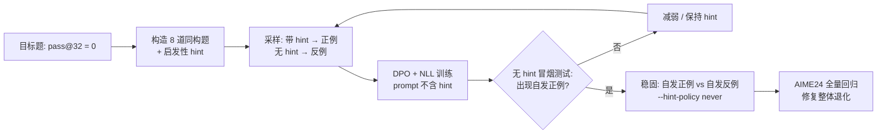

# DPO Ignition：用 DPO 代替 SFT 给推理模型"点火"

**中文** | [English](README.md) | 🤗 LoRA 权重：[`YichengWangCA/R1-Distill-Qwen-14B-AIME-DPO-LoRA`](https://huggingface.co/YichengWangCA/R1-Distill-Qwen-14B-AIME-DPO-LoRA) 

> 用 **rank-32 LoRA** 在 **DeepSeek-R1-Distill-Qwen-14B** 上做 DPO 点火。模型原本在 AIME 2024 的 30 题里有 6 题 32 次采样都做不对，点火后其中 2 题被攻克：AIME 2024 **cons@32 从 80.0%（24/30）提升到 86.7%（26/30）**。LoRA 权重已发布在 [Hugging Face](https://huggingface.co/YichengWangCA/R1-Distill-Qwen-14B-AIME-DPO-LoRA)。

---

## 目录

- [动机](#动机)
- [方法：DPO 点火](#方法dpo-点火)
- [损失函数](#损失函数)
- [超参数](#超参数)
- [数据集：AIME 2024](#数据集aime-2024)
- [各题实验记录](#各题实验记录)
- [局限性](#局限性)
- [讨论与后续工作](#讨论与后续工作)
- [仓库结构](#仓库结构)
- [复现](#复现)
- [添加新场景](#添加新场景)

---

## 动机

GRPO 这类 on-policy RL 只能**放大模型已有的正确信号**。如果模型在某个场景下多次采样的成功率为 0，组内所有样本的奖励都一样，优势为 0，GRPO 没有梯度可用。

这种情况通常先做一轮 SFT，注入外部信息，让模型从无到有产生正确信号，这一步叫**点火（ignition）**。但传统 SFT 有两个问题：

1. **分布伤害**：SFT 的正样本通常来自别的模型（或人写的解答），等于把另一个分布强行移植到目标模型上，对模型原有分布伤害比较大。
2. **数据成本**：SFT 需要大量正样本，一般要求约 100 条不同的解题路径。

## 方法：DPO 点火

核心想法：**正样本由目标模型自己生成，只是在生成时借助了一个启发性提示（hint）；训练时把 hint 拿掉。**

1. **构造启发性提示**：在 prompt 中加入针对该场景的提示词，使模型能*自发地*产生正确的思维链（CoT）。
2. **构造偏好对**：
   - 正例（chosen）：**带 hint** 的 prompt 下模型自己生成的正确 CoT
   - 反例（rejected）：**无 hint** 的 prompt 下模型原本的错误输出
   - 训练用的 prompt 一律是**无 hint** 的题面
3. **多轮迭代 + 提示冒烟测试**：每轮 DPO 结束后做冒烟测试，逐步删减 hint，观察模型在更少的提示下能否产生正确信号；直到模型在**无提示**下也能产生正确信号（出现"自发正例"），说明这个启发性提示已经被内化进模型原有的分布。
4. **稳固**：出现自发正例后，改用"自发正例 vs 自发反例"再训练几轮，把新学到的能力稳定下来。



和 SFT 相比，这样做有两点好处：

- **正例来自模型自己的分布**：带 hint 的 CoT 仍然是目标模型自己采样出来的，与其原有分布的距离远小于外部模型的解答。
- **反例提供了"不要走哪条路"的信号**：DPO 不仅抬高正确路径，也显式压低模型原本偏好的错误路径（比如 II-9 中典型的"忘了加回 2 个单色网格"）。

### 为什么用同构题而不是原题

直接在原题上训练会污染评测：原题（AIME24 中的那道）始终作为 **held-out 探针**，不进训练集。点火数据全部来自程序生成的同构题：参数不同、结构相同，答案由程序用 `Fraction` 精确验算，脚本启动时还会用原题的官方答案反向自检公式。

### 数据质量控制（`gen_ignition_pairs.py`）

| 问题 | 处理 |
|---|---|
| 带 hint 的正例写出 "The hint says…" | 训练 prompt 里并没有 hint，这等于教模型引用一个不存在的提示。先正则改写成自述，仍有残留或大段逐字引用 hint 的直接丢弃 |
| 带 hint 的正例只是套公式 | 要求 CoT 中出现该场景的推导痕迹（如 torus 的 *collinear / similar triangles*）|
| 自发正例是蒙对的 | 场景可定义质量门槛（如 chips 要求出现 *maximal/empty* 与 `2^`）|
| 噪声 / 尾部复读 / 截断 | 分别统计；无 `\boxed{}` 的截断样本作为合法反例保留 |
| 反例多样性 | 场景可按失败模式分桶交错（chips：`count-2` / `2^(m+n)-2` / `2^(m+n)`）|

## 损失函数

单阶段目标，在 DPO 的基础上给正例加一个 NLL 项：

$$
\mathcal{L} = -\log\sigma\Big(\beta\big[(\ell_\theta(y_c)-\ell_{\text{ref}}(y_c)) - (\ell_\theta(y_r)-\ell_{\text{ref}}(y_r))\big]\Big) + \lambda\cdot\Big(-\frac{\ell_\theta(y_c)}{W_c}\Big)
$$

其中 $\ell(y)=\sum_t w_t\log\pi(y_t\mid x,y_{<t})$ 是（加权）序列对数概率。

**关于两项的设计：**

- **NLL 项**：标准 DPO 在压低反例时常常把正例的似然一起压下去（DPO 已知的失效模式），NLL 项用来提高正例出现的频率，防止正例似然塌缩。NLL 项按 token 取平均（除以加权长度 $W_c$）。
- **DPO 项用 sum，不做 per-token 归一**：解题用的 token 数本身就是重要信息，不应被长度稀释；sum 还会天然惩罚过长的 CoT。
- **长度钝化（LD-DPO 风格，`--ld-alpha`）**：取公共长度 $K=\min(|y_c|,|y_r|)$，前 $K$ 个 token 权重 $w_t=1$，超出部分 $w_t=\alpha$，$W=K+\alpha(|y|-K)$。$\alpha=1$ 就是标准 DPO，$\alpha=0$ 等价于把较长一侧截到公共长度。动机是：反例（通常是较长的一侧）里可能也有正确的贝叶斯推断，只是一开始犯了错或没想到正确方法，不应该把整条反例都压下去。

**影响复现的实现细节（`train_dpo_nll.py`）：**

- **Reference logprob 预先计算并缓存**：用起始 adapter 的权重（即 reference）先过一遍所有 pair，训练时不需要来回切换 LoRA。
- **分块投影 LM head**：只取一次隐藏态，只对 completion 位置分块过 `lm_head`，从不物化完整的 `[seq, vocab]` logits。22k token 时每条序列可省约 6.2 GiB。
- **只给正例补 EOS**：采样时用 `skip_special_tokens=True` 解码，模型自己生成的 EOS 被去掉了，补回来才是真实目标。
- **加载时丢弃退化 pair**：空正例、空反例、正反例相同。这三种会悄悄产生零梯度或单边梯度，而训练日志看起来仍然正常。

## 超参数

以下超参数和样本量基于 **DeepSeek-R1-Distill-Qwen-14B + rank-32 LoRA（4-bit NF4 QLoRA）**。

| 参数 | 取值 | 说明 |
|---|---|---|
| LoRA rank / alpha / dropout | 32 / 64 / 0.05 | `init_lora.py` 默认值 |
| Target modules | `q,k,v,o,gate,up,down_proj` | |
| 可训练参数 | 137,625,600 | |
| Base 精度 | 4-bit NF4，double quant，bf16 compute | |
| 每轮 pair 数 | ~200 | 8 道同构题 × 每题 32 次采样；实验下来 200 对一轮比较稳 |
| β（DPO 温度） | 0.1 | 第一轮扫描 β / λ / LR，选 loss 最低的 |
| λ（NLL 权重） | 0.2 ~ 0.3 | |
| Learning rate | 5e-6 | |
| Epochs | 2 | 第二个 epoch 的 loss 基本稳定 |
| Grad accumulation | 4 | |
| DPO log-prob 归一 | `sum` | 见[损失函数](#损失函数) |
| `--ld-alpha` | 0.2 ~ 0.3 | 从第二道题（I-8）开始加入，见下文 |
| 采样温度 / top-p | 0.6 / 0.95 | 采样与测试相同 |
| 最大序列长度 | 18500 | 采样 `--max-new-tokens` 与训练 `--max-len` 均设为 18500（脚本默认值分别为 16000 / 22000）|

**为什么引入 `--ld-alpha`**：点火I-8时 α=1。虽然这道题的正确率提升很大，但 AIME24 的其他题出现了明显退化。一个猜测是：标准 DPO 把反例里可能正确的推理片段也一起压下去了。这个猜测还需要更多消融实验验证。

**为什么温度取 0.6**：温度过高时，长思维链下的正确率下降得很厉害，训练也更难。

## 数据集：AIME 2024

原本使用 `simplescaling/aime24_nofigures`，但发现 **Problem I-8 缺少条件**，换 `simplescaling/aime24_figures` 也一样。因此自建了一份 AIME 2024 数据集：**[`YichengWangCA/aime24-official`](https://huggingface.co/datasets/YichengWangCA/aime24-official)**。

**Baseline**：DeepSeek-R1-Distill-Qwen-14B 在 AIME 2024 上 pass@32 = **80%（24/30）**，pass@1 约 **52%**。32 次采样全部失败的 6 题：

| 题目 | 是否点火 | 结果 |
|---|---|---|
| 2024-I-8 | ✅ | 成功 |
| 2024-I-11 | 尝试后放弃 | — |
| 2024-I-12 | — | |
| 2024-II-8 | ✅ | 单题成功，整体退化过多，放弃 |
| 2024-II-9 | ✅ | 成功 |
| 2024-II-15 | — | |

其中 I-8、II-8、II-9 比较容易构造同构场景，所以选了这三题点火。

## 各题实验记录

### 2024 AIME II-9：5×5 网格放棋子（成功，5 轮）

场景：`chips`。同构题为 $m\times n$ 网格，答案为 $2+(2^m-2)(2^n-2)$。8 个同构场景：2×2、2×3、3×3、3×4、4×4、3×6、4×6、4×7；原题 5×5 held-out。

| 轮次 | 正例来源 | pair 数 | 结果 |
|---|---|---|---|
| R1 | hint | 50 | hint 下正确率上升，闭卷输出的 token 总数下降 |
| R2 | hint | 50 | 同上趋势延续 |
| R3 | hint | 200 | **出现自发正例** |
| R4 | 自发 | 50 | 稳固 |
| R5 | 自发 | 50 | 稳固 |

> 自发配对阶段可以一个正例配多个反例，但**不建议同一正例配 4 个以上反例**，否则会引起退化（`--max-reuse 4`）。

### 2024 AIME I-8：三角形内的切圆链（成功，3 轮）

场景：`circles`。同构题改变两串圆的半径和个数 $(r_1,n_1,r_2,n_2)$，程序同时校验三角形存在性。

| 轮次 | 正例来源 | pair 数 | 结果 |
|---|---|---|---|
| R1 | hint | ~200 | **出现自发正例** |
| R2 | 自发 | ~200 | 稳固 |
| R3 | 自发 | ~200 | 稳固 |

### 整体回归修复

点火上面两题后，AIME24 整体 **pass@1 下降严重**（点火前约 52%）。随后在 AIME24 全集上用 `gen_dpo_dataset.py` 做自发配对（每题 32 次采样，约 200 对），训练 2 轮后 pass@1 回升到 **64%**，pass@32 为 **26/30**。

> ⚠️ 这一轮修复是在 AIME24 本身上做的自发配对训练，所以 64% 的 pass@1 是**训练集上**的数字，不能当作泛化能力的证据。点火本身（I-8、II-9 从 0 到有）只用同构题训练，原题始终 held-out，这部分结论不受影响。

### 2024 AIME II-8：环面与球相切（单题成功，整体退化过多，放弃）

场景：`torus`。同构题改变 (管半径, 轴距, 球半径)，提供 `strong` / `weak` 两档 hint。

- 做了 3 轮、每轮 200 对的 DPO 后出现自发正例，但 AIME24 整体 pass@32 下降太多。
- 退回到第一轮 200 对之后的版本，把 AIME24 自发配对和本题 8 场景 × 32 采样的配对合并训练，效果仍然不好。
- 推测：可能已经用到了 rank-32 LoRA 能提供的可训练自由度上限（见[局限性](#局限性)）。

### 2024 AIME I-11：正八边形双色着色（放弃）

这道题需要枚举所有情况并去重，这不是 LLM 擅长的。测试了 Kimi K3、Claude Opus 和 Claude Fable，它们都是先写 Python 脚本暴力搜索出答案。我也认为解决这类场景最便捷的方式是写程序搜索。但本项目目前只点火**模型仅靠 CoT 就能完整解决**的场景，而且这道题做了几轮 DPO 后，解题所用的 token 数也不收敛，所以放弃。 此同构题的构造也比较难，一个可能的方向：在正六边形、正八边形、正十边形上，按不同的蓝/红数量（0 蓝 6 红、1 蓝 5 红……）细分场景。

未来可以把这套点火思路用到 agent / harness 场景（允许模型调用代码）。

## 局限性

1. **超参数与样本量**基于 DeepSeek-R1-Distill-Qwen-14B + rank-32 LoRA，换模型或换秩需要重新扫描。
2. **适用场景**：AIME24 上点火的题都是比较容易构造同构题的题型。遇到更复杂的场景，同构题需要构造得更精细。
3. **容量上限？** 点火第三道题（II-8）时整体退化非常明显。原因可能是：
   - 撞到了 rank-32 LoRA 能注入的信息上限；
   - dense 架构本身的问题；
   - 这道题的解题思路与模型原有分布有冲突。

   计划对照实验：**直接从 base 模型点火 II-8**，看是否出现同样的退化。
4. **算力**：采样推理在本地 RTX 5090 上完成，训练在 RunPod 租用的 H200 上完成。

## 讨论与后续工作

- **自蒸馏点火**：只要启发性提示的冒烟测试能成功，用自蒸馏（带 hint 生成、无 hint SFT）做点火应该也可行，而且可能比 DPO 点火更高效、更鲁棒。
- **用 GRPO 稳固**：本实验在出现自发正例后，继续用自发正例/反例做 DPO 来稳固，没有切换到 GRPO。按照最初的动机，稳固阶段换成 GRPO 可能更高效，退化也更小。
- **`--ld-alpha` 的消融**：α 对单题提升与全局退化之间的权衡还需要更多数据点。

这几点如果以后有更多算力和时间，会做消融测试。

---

## 仓库结构

```
dpo-ignition/
├── README.md                 # 中文
├── README_EN.md              # English
├── requirements.txt
├── .gitignore
├── gen_ignition_pairs.py      # 同构题族点火配对收集 (通用入口, --scenario 选场景)
├── gen_dpo_dataset.py         # 数据集(AIME24)闭卷自发配对收集, 用于整体回归修复
├── train_dpo_nll.py           # DPO + NLL 训练 (ref 缓存 / 分块 lm_head / LD-DPO)
├── init_lora.py               # 创建零增量 LoRA 作为第一轮的 --init-adapter
└── ignition/
    ├── common.py              # 解码修复、答案抽取、质量过滤、模型加载、采样、分拣
    └── scenarios/
        ├── base.py            # Scenario 接口 (新增场景继承它)
        ├── chips.py           # 2024 AIME II-9
        ├── circles.py         # 2024 AIME I-8
        └── torus.py           # 2024 AIME II-8
```

## 复现

```bash
pip install -r requirements.txt

# 0. 检查同构题与程序验算的答案 (不加载模型)
python gen_ignition_pairs.py --scenario chips --dry-run

# 1. 初始 adapter (零增量, 等价于 base 模型; r=32, alpha=64, dropout=0.05)
python init_lora.py --output models/r0

# 2. 冒烟: hint 能否让模型产生正确信号? 逐步删减 hint 时用 --hint-file
python gen_ignition_pairs.py --scenario chips --adapter models/r0 --problems 1,2 \
    --num-samples 4 --output smoke.jsonl

# 3. 点火轮: 带 hint 正例 vs 闭卷反例
python gen_ignition_pairs.py --scenario chips --adapter models/r0 --num-samples 32 \
    --max-new-tokens 18500 --output chips_r1.jsonl --dump-raw chips_r1_raw.jsonl
python train_dpo_nll.py --data chips_r1.jsonl --init-adapter models/r0 --output models/r1 \
    --beta 0.1 --lambda-nll 0.2 --lr 5e-6 --epochs 2 --max-len 18500 --ld-alpha 0.2
#    ... 重复直到日志出现 "出现自发正例的题: 8/8"

# 4. 稳固轮: 只用自发正例, 同一正例最多配 4 个反例
python gen_ignition_pairs.py --scenario chips --adapter models/r3 \
    --hint-policy never --max-reuse 4 --max-new-tokens 18500 --output chips_r4.jsonl
python train_dpo_nll.py --data chips_r4.jsonl --init-adapter models/r3 --output models/r4 --max-len 18500 --ld-alpha 0.2

# 5. 整体回归修复: 在 AIME24 全集上做闭卷自发配对
python gen_dpo_dataset.py --adapter models/r5 --dataset <HF_USER>/<DATASET> \
    --num-samples 32 --max-new-tokens 18500 --output aime24_pairs.jsonl
python train_dpo_nll.py --data aime24_pairs.jsonl --init-adapter models/r5 --output models/r6 --max-len 18500 --ld-alpha 0.2

# 混合训练 (如 II-8 的尝试): 直接拼接 jsonl
cat aime24_pairs.jsonl torus_pairs.jsonl > mixed.jsonl
```

`gen_ignition_pairs.py` 的主要开关：

| 参数 | 作用 |
|---|---|
| `--hint-policy always\|fallback\|never` | 点火 / 过渡（已有自发正例就跳过 hint 采样）/ 稳固 |
| `--hint strong\|weak` 或 `--hint-file` | hint 档位或自定义 hint，用于逐步删减提示 |
| `--max-reuse N` | 同一正例最多配几个反例 |
| `--params "2x2;3x5"` | 自定义同构题参数（原题与 held-out 参数会被拒绝）|
| `--include-target` | 把原题也加入训练（此后 AIME24 评测不再可信）|
| `--dump-raw` | 保存全部原始采样及分拣标签，便于人工核查 |

> `gen_dpo_dataset.py` 若在同目录找到 `_answer_utils.py`，会启用更完整的答案等价判定（LaTeX / 多解等）；找不到则回退为纯数字比较，AIME 足够用。

## 添加新场景

在 `ignition/scenarios/` 下新建文件，继承 `Scenario`：

```python
from .base import Scenario

class MyScenario(Scenario):
    name = "my"
    target_desc = "2024 AIME X-N — ..."
    params = [(...), ...]            # 同构题参数
    target = (...)                   # 原题参数, 自动 held-out
    hints = {"strong": "...", "weak": "..."}
    default_hint = "strong"
    derivation_pattern = r"..."      # 带 hint 正例必须出现的推导痕迹

    def solve(self, *p): ...         # 程序算出答案字符串, 并断言构型合法
    def make_question(self, *p, with_asy=True): ...
    def self_check(self):            # 用原题官方答案自检公式
        assert self.solve(*self.target) == "..."
```

然后在 `ignition/scenarios/__init__.py` 中注册即可。`selfgen_ok`（自发正例质量门槛）和 `order_rejected`（反例排序）按需覆盖。
